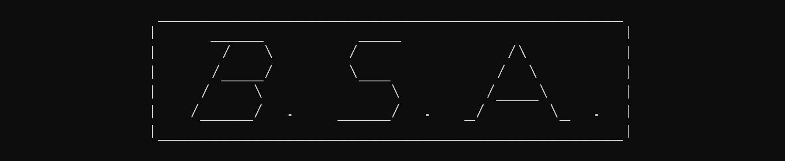

<!--  -->

# Brief Description
-------------------

`BsaLib`, a Modern Fortran Library for the Bispectral Stochastic Analysis 
of structures under non-Gaussian stationary random actions.

> NOTE: currently, only wind action is included in the library, but other phenomena (waves for instance) can be easily integrated. 
> See [further developments](#what's-missing?-further-developments).


# License
---------

`BsaLib` is release under the **GNU Lesser General Public License v3.0**.
Visit the [GPL official website](https://www.gnu.org/licenses/gpl-3.0.html) for more information.


# Code structure

There are two parts in this repository: 

1. [`BsaLib`](#`bsalib`:-core-library), the core library;
2. [`BSA`](#`bsa`:-executable-program), the built-in executable program.


## `BsaLib`: core library

`BsaLib` is the main core of this repository. 
It consists of the main library and its API to which anyone could link to and interact with.
To use `BsaLib`, simply import the main `BsaLib` API module:

```Fortran
program test
    use, non_intrinsic :: BsaLib
    implicit none (type, external)
    ! your declarations here

    ! your logic here

    ! initialise BsaLib
    call bsa_Init()

    ! set BsaLib internal state through its API procedures

    ! once done, run BsaLib
    call bsa_Run( ... args ... )

    ! finally, release BsaLib memory
    call bsa_Finalise()
end program
```

Being designed as a *plug-in* library, it needs the hosting program/library 
to provide some data needed by `BsaLib` in order to function properly.


## `BSA`: executable program

As a side project package, a single-source executable file is provided under `./app/`. 
It emulates what one would normally do when using `BsaLib` as a *plug-in* for its own 
library/program. 
On the other hand, this program is thought and provided for all those interested in using 
`BsaLib` but not having any hosting library/program. 
Nonetheless, even if this program is provided, the user would yet need to provide the data 
for `BsaLib` to function properly. If any of this data is not provided, the `BsaLib` runtime check 
would detect it and abort correct logic flow.

For that, the provided executable program relies on reading two input files:

1. `BsaLib` related settings (formatted file, named `bsa.bsadata`). 
For details, read the [dedicated section](https://github.com/miEsMar/BsaLib/blob/main/readme_files/bsadata.md).
2. External data file (named `bsa.extdata`), in binary format, containing 8-byte floating point records 
(`real64` of the `iso_fortran_env` compiler intrinsic module). 
For full details, read the [external data section](https://github.com/miEsMar/BsaLib/blob/main/readme_files/extdata.md).

# What's missing? Further developments
--------------------------------------

Mathematical:

- [ ] Integrate models for other non-Gaussian actions (waves, for instance)
- [ ] Extend to non-diagonal modal Frequency Response Function (FRF) models
- [ ] Extend to frequency-dependent modal matrices (e.g. aeroelastic phenomena in Wind Engineering)
- [ ] Add library core to generate spectra (PSDs and Bispectra) from time series

Numerical:

- [ ] Adapt Classic approach to dump BFM info as in Mesher (easy)
- [ ] Improve internal policy mechanism and integration (WIP)
- [ ] Provide a general API for user defined models integration
- [ ] Complete full support for spatial (in-plane) symmetries of a real-valued bispectrum
- [ ] Compute nodal correlation internally (don't require it as user data)
- [ ] Add support for Mesher zones' interest modes
- [ ] Add a local caching system
- [ ] Add `MPI` support (for running `BsaLib` on multi-node clusters)
- [ ] Improve and extend GPU offloading capabilities
- [ ] Provide automation service to convert user-level model function into GPU-kernel code
- [ ] Enhance the mechanism that lets the user provide its own desired exporting function, 
so that `BsaLib` is not tight to any specific exporting format.
- [ ] Integrate a built-in bispectrum post-processing Visualiser (using [Vulkan](https://www.vulkan.org/), for optimal performances)


# Known Issues
--------------

There is one main known issue in the current version. 

> Using `OpenMP` parallelisation in the second Post-meshing phase, 
> execution time is higher compared to serialised version. 
> This is due to the necessary synchronisation between threads when accessing 
> shared file I/O when reading each zone's dumped data, causing the `critical` 
> section to be the main bottleneck in this part.
> For a proper use of `OpenMP` parallelisation in Post-meshing phase, a fundamental
> rethinking of the algorithmic structure needs to be done.
> A first, temporary, possible solution, could be the usage of thread-level private
> I/O with dedicated units, avoiding the need to synchronise when reading back 
> information in post-meshing phase. However, this might soon become inelegant solution 
> when the number of threads would start increasing considerably.
> For this, as a temporary solution, a conditional compilation flag 
> (`BSA_USE_POST_MESH_OMP`) can be used to control effective use of 
> `OpenMP` parallelisation in Post-meshing phase, **disabled by default**.


# Related Scientific Publications
-------------------------------

1. [Non-Gaussian buffeting analysis of large structures by means of a Proper Orthogonal Decomposition](https://www.sciencedirect.com/science/article/abs/pii/S0167610523002799?via%3Dihub)
2. [A multiple timescale approach of bispectral correlation](https://www.sciencedirect.com/science/article/abs/pii/S0167610522003786?via%3Dihub)
3. [On the background and biresonant components of the random response of single degree-of-freedom systems under non-Gaussian random loading](https://www.sciencedirect.com/science/article/abs/pii/S0141029611001507)


